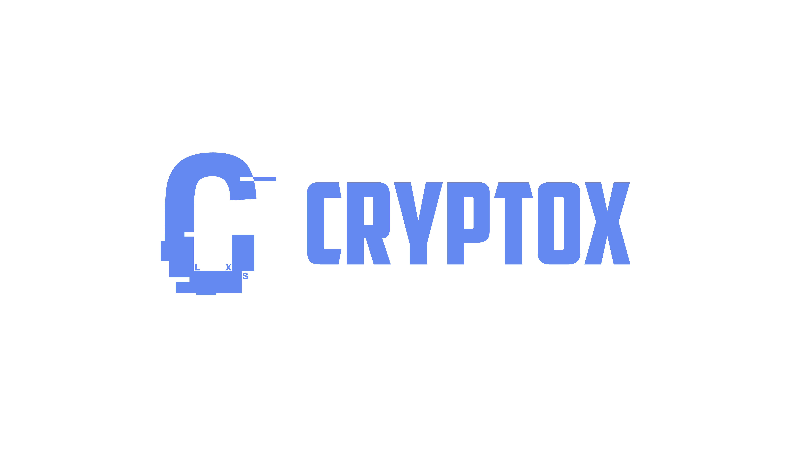
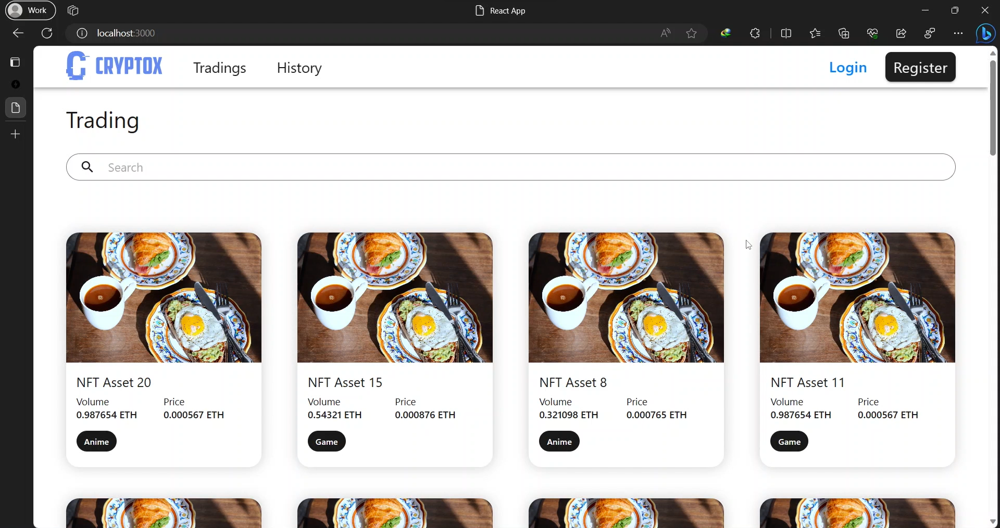

<h1>Decentralised Trading Platform - Frontend</h1>

  

<br>

<details id="nav" open>
<summary><b>Contents</b></summary><br>

- [**Overview**](#overview)
- [**Installation**](#installation) 
- [**Getting started**](#getting-started)
- [**Members/Contributors**](#memberscontributors) 
- [**Licence**](#licence)

</details>

## Overview
<sup>[**\[ Back to Contents  ↑ \]**](#nav)</sup>

**CRYPTOX** is a decentralised trading platform that utilises blockchain and smart contract technology.

#### Frontend Core Functionalities
- Browse available digital assets
- Search assets by name, lowest price and their categories
- Basic Authentication that allows users to log in/register and view and search their past transactions.
- Trade assets, currently limited to one functionality: `Buy`




## Installation
<sup>[**\[ Back to Contents  ↑ \]**](#nav)</sup>

The frontend component requires [`NodeJS`](https://nodejs.org/en/download). Please make sure that your `NodeJS` version is at least `18.7.0`.

To install the frontend component, just simply do the following:

```
git clone https://github.com/COS30049/cos30049_frontend.git
npm install --force
```


## Getting started
<sup>[**\[ Back to Contents  ↑ \]**](#nav)</sup>

>⚠️ **This project/software requires further steps in the [backend component](https://github.com/COS30049/cos30049_backend) to be fully functional.**

Once the backend component is installed, just run
```
npm start
```

## Members/Contributors
<sup>[**\[ Back to Contents  ↑ \]**](#nav)</sup>

| Name                 | Student ID | Email                         |
| :------------------- | ---------- | :---------------------------: |
| Minh Nguyen `LEADER` | 103534696  | 103534696@student.swin.edu.au |
| Ryan Vu              | 103511424  | 103511424@student.swin.edu.au |
| Hoang Bao Phuc Chau  | 103523966  | 103523966@student.swin.edu.au |

## Licence
<sup>[**\[ Back to Contents  ↑ \]**](#nav)</sup>

This project/software is provided under `MIT Licence`.
